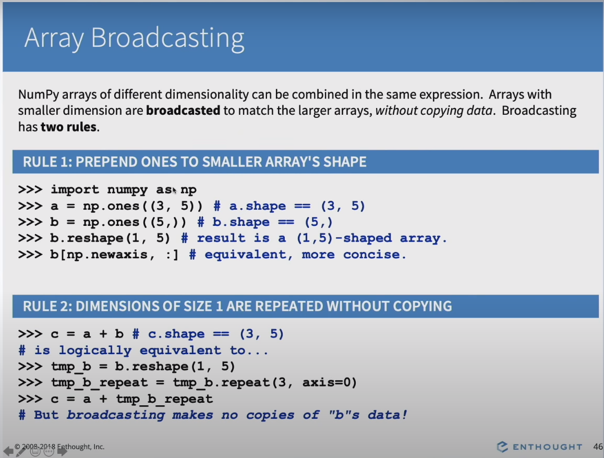
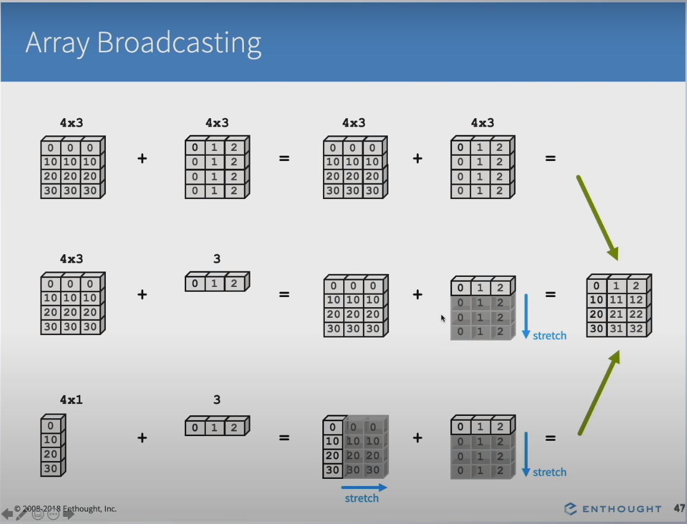

# Numpy-Tutorial

Trong này là một số kiến thức mình học được trong quá trình tìm hiểu Numpy, cái này khá hữu ích.

## 1. Broadcasting
Mảng numpy với nhiều kích thước có thể kết hợp lại với nhau. Mảng với dimension nhỏ hơn có thể được broadcasted để khớp với mảng có dimension lớn hơn mà không cần thực hiện *copy data*. Broadcasting có 2 quy tắc:
- **Quy tắc 1** - thêm (có thể nhiều lần nếu dimension lớn hơn) vào shape của mảng nhỏ hơn (cho cùng số dimension)
- **Quy tắc 2** - Dimension có kích thước 1 (1 phần tử) được lặp lại mà không cần copy data

Trường hợp cuối a có shap là `(4, 1)`, b có shape là `(3,)`. 
- Theo quy tắc 1 chúng ta thêm 1 vào shape của b để 2 mảng có cùng dimension, shape của b bây giờ là `(1, 3)` (do 3 đang là số element của axis cuối nên cần thêm vào axis đầu).
- Theo quy tắc 2, chúng ta có thể lặp lại dimension 1 của a 3 lần, chúng ta có shape mới của a là (4, 3). CÓ thể lặp lại dimension 1 của b 4 lần, chúng ta có shape mới của b là (4, 3).

Trường hợp sau không thực hiện broadcasting được: a có shape `(3, 4)`, b có shape `(3,)`. Theo quy tắc 1 chúng ta có shape mới của b là `(1, 3)` nhưng không có cách nào để khớp 2 arrays lại được với nhau.

## Setting array elements

# Tài liệu tham khảo
1. https://www.youtube.com/watch?v=ZB7BZMhfPgk